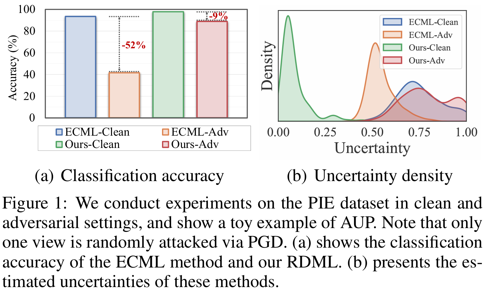
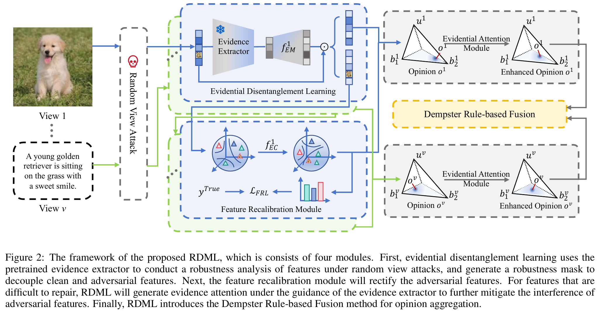

# Pytorch implementation of Reliable Disentanglement Multi-view Learning Against View Adversarial Attacks (IJCAI 2025) **[[arXiv](https://arxiv.org/abs/2505.04046)]**

This is the official implementation for [Reliable Disentanglement Multi-view Learning Against View Adversarial Attacks](https://arxiv.org/abs/2505.04046) (IJCAI 2025) by Xuyang Wang, Siyuan Duan, Qizhi Li, Guiduo Duan, Yuan Sun and Dezhong Peng.

(i) This paper studies a less-touched adversarial unreliability problem (AUP) for existing trusted multi-view learning.
<p align="center">

</p>
(ii) We proposes a new Reliable Disentanglement Multi-view Learning (RDML) framework against view adversarial attacks.

<p align="center">

</p>

## Usage Example
To run our RDML in clean or adversarial setting:

```
python main.py
```

## Citation
If you find this work useful or interesting, please consider citing it.
```
@misc{wang2025RDML,
      title={Reliable Disentanglement Multi-view Learning Against View Adversarial Attacks}, 
      author={Xuyang Wang and Siyuan Duan and Qizhi Li and Guiduo Duan and Yuan Sun and Dezhong Peng},
      year={2025},
      eprint={2505.04046},
      archivePrefix={arXiv},
      primaryClass={cs.LG},
      url={https://arxiv.org/abs/2505.04046}, 
}
```

## Acknowledgement
The code is inspired by [ECML: Reliable Conflictive Multi-view Learning](https://github.com/jiajunsi/RCML) and [Feature Separation and Recalibration for Adversarial Robustness](https://github.com/wkim97/FSR).
